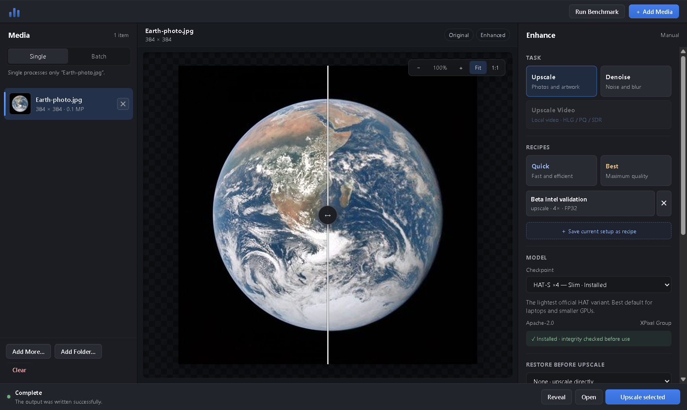

# LocalSR

**Image and video restoration on your computer.**

Upscale photos, clean up noise and blur, and restore video with models you choose.
LocalSR runs inference locally, shows the tiles as they finish, and lets you compare
results while the queue keeps working. Media stays on your machine.

[Website](https://herrei.github.io/localsr/) · [Documentation](docs/README.md) ·
[Models](docs/models/README.md) · [Contributing](CONTRIBUTING.md)



*Actual Windows beta capture. [Image credit and capture details](docs/assets/README.md).*

The prepared beta also imports common older recordings such as AVI, MPEG/VOB,
WMV and camcorder video, with local playback conversion where needed.
See [video support and tested limits](docs/video-support.md).

## Beta status

**v0.0.13-beta.1 is being prepared for public testing.** The version is provisional;
final installers, source distribution and public downloads are still under review.
See the [release notes](docs/releases/v0.0.13-beta.1.md),
[known limitations](KNOWN_LIMITATIONS.md) and [beta checklist](docs/beta-release-checklist.md).
Earlier alpha packages have their own release notes and support limits.

## What you can do

- Upscale photos, illustrations, screenshots and anime at 2×, 3× or 4×.
- Denoise, deblur or remove JPEG artifacts before upscaling.
- Process images and videos in a queue; save folder jobs together in `LocalSR Results`.
- Compare original and enhanced media, including synchronized video playback.
- Follow real model tiles, frame progress and estimates for the current job and queue.
- Save recipes and measure CPU and GPU performance with separate benchmarks.

Image inputs include JPEG, PNG, WebP, TIFF and DNG camera RAW. Video processing
preserves source timing, normalizes supported orientation metadata and retains
compatible audio. [Format and colour details](docs/metadata.md) · [Video support](docs/video-support.md).

## Hardware

| Platform | Available engines | Recorded beta coverage |
| --- | --- | --- |
| macOS 14+ · Apple Silicon | MPS | Signed native worker: image, video, cancellation and recovery |
| Windows · x86-64 | CPU, DirectML, CUDA | Windows 11: CPU and Intel UHD 620 through DirectML; CUDA hardware untested |
| Linux · x86-64 | CPU, AMD ROCm, NVIDIA CUDA, Intel XPU | CPU and RX 9060 XT through ROCm; CUDA/XPU hardware untested |

Package availability and installed acceptance are recorded in the
[platform matrix](docs/beta-platform-matrix.md). A supported engine still needs a
compatible GPU and driver; some operators may fall back to the CPU.

Large images and video can take hours or days. Memory use depends on the model,
resolution and clip length; 16 GB of GPU memory does not guarantee that a job fits.
Start with a small image or a short clip and inspect the output before a long run.

## Models and Labs

Choose a lightweight SPAN model for quick photo upscaling, HAT-S/HAT-L for general
restoration, or a specialist such as NomosWebPhoto, HFA2k or NAFNet. Models download
on demand and are checked against their pinned size and SHA-256 before loading.
The [model guide](docs/models/README.md) lists the full catalog and each license.

NomosWebPhoto and HFA2k are by Philip Hofmann (Phips / Phhofm), under
[CC BY 4.0](https://creativecommons.org/licenses/by/4.0/). LocalSR downloads the
unchanged publisher checkpoints and keeps attribution and source/license links visible.
The two HAT face companions require verified user imports while their checkpoint
rights remain unresolved. No restoration weights are included in installers.

**Labs** features include SeedVR2 3B, HAT HDR preservation, de-flicker and video face
processing. SeedVR2 exports SDR. The HAT models were trained on SDR, so HDR output
quality remains unverified. Model and engine compatibility is shown in the app.
See [model licensing](docs/model-licenses.md) and [current limits](KNOWN_LIMITATIONS.md).

## Build and contribute

The desktop app uses Svelte and Tauri, with an isolated Python inference worker.
Use Python 3.11, Node.js and Rust; platform prerequisites and commands are in the
[desktop guide](desktop/README.md) and [development guide](docs/development.md).

From the repository root:

```sh
./local-ci.sh setup
./local-ci.sh
```

`setup` installs development dependencies. The remaining checks reuse them.
Launching the current desktop app and packaging it are separate steps in the desktop guide.
The Python CLI supports [processing, watch folders and benchmarks](docs/automation.md).

## Feedback

For questions or private reports, contact
[hermes.reisner@gmail.com](mailto:hermes.reisner@gmail.com).
A public issue tracker will accompany the beta; its launch is still pending.
For a bug report, include the app version, model, device and reproduction steps.
**Copy diagnostics** omits source paths, filenames and image contents.
[Security reports](SECURITY.md) should be sent privately.

## License

LocalSR's application code is [MIT licensed](LICENSE). Dependencies and model
checkpoints retain their own terms. [Third-party notices](THIRD_PARTY_NOTICES.md)
and [model licenses](docs/model-licenses.md) describe those terms and the remaining
redistribution work. Public releases will include matching source and build
materials required by their bundled components.
